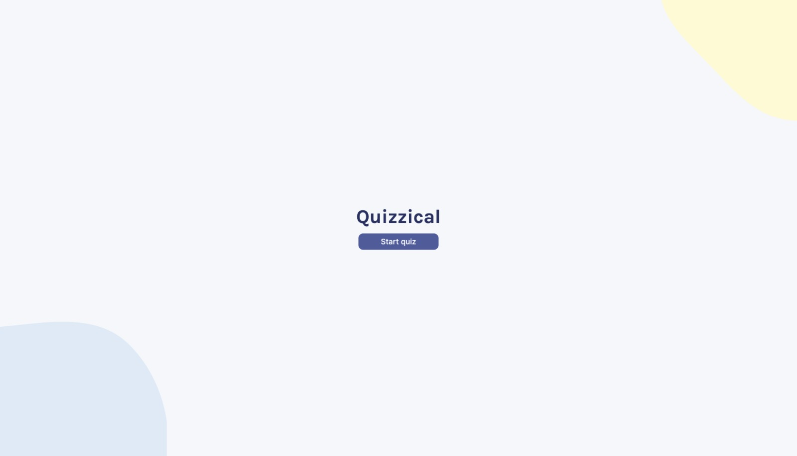
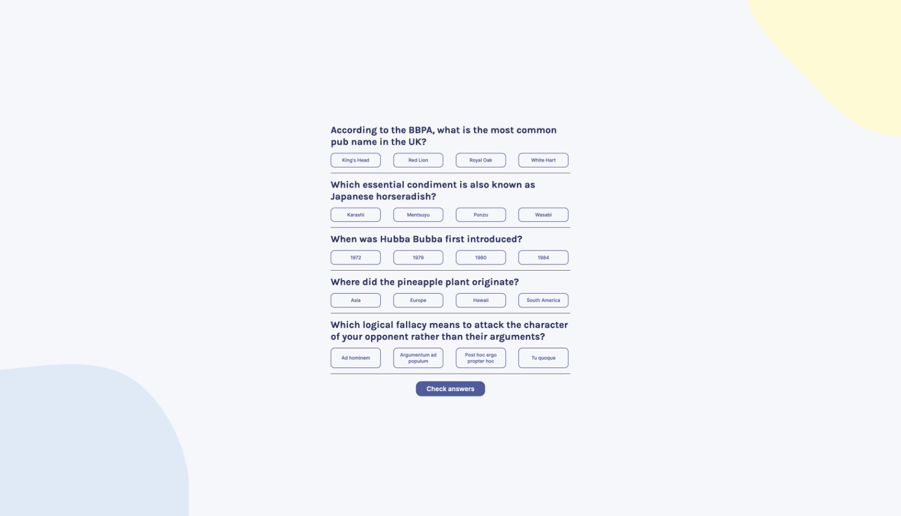
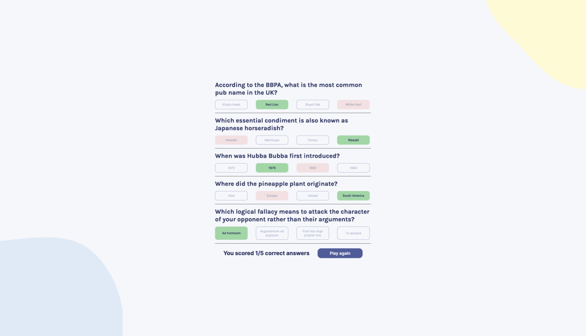

# Quizzical

Language: 
  
  

Coding Language/Framework: 
  
  
  
   
  
  
  

Tools: 
  
  
  

  
  
  

## Descrição

Este foi um dos mais maravilhosos projetos que eu já fiz!

Ele utiliza dados da Trivia API! E então limpa (Já que a API ainda usa JQuery)

E aplica neste casual mas divertido pequeno jogo!

### Praticado:
    1. Componentes e Hooks React
    2. chamada de API e promessas
    3. Lógica de programação
    4. Estilizando com CSS
    5. Lógica do jogo

## Description

This has been one of the most amazing projects I've ever done!

It uses data from a Trivia API! Then it cleans up a little bit (due to the API still using JQuery)

And it applies to this casual yet funny little game!

### Practiced:
    1. React components & hooks
    2. API call & promises
    3. Logic programming
    4. Styling css
    5. Game logic!