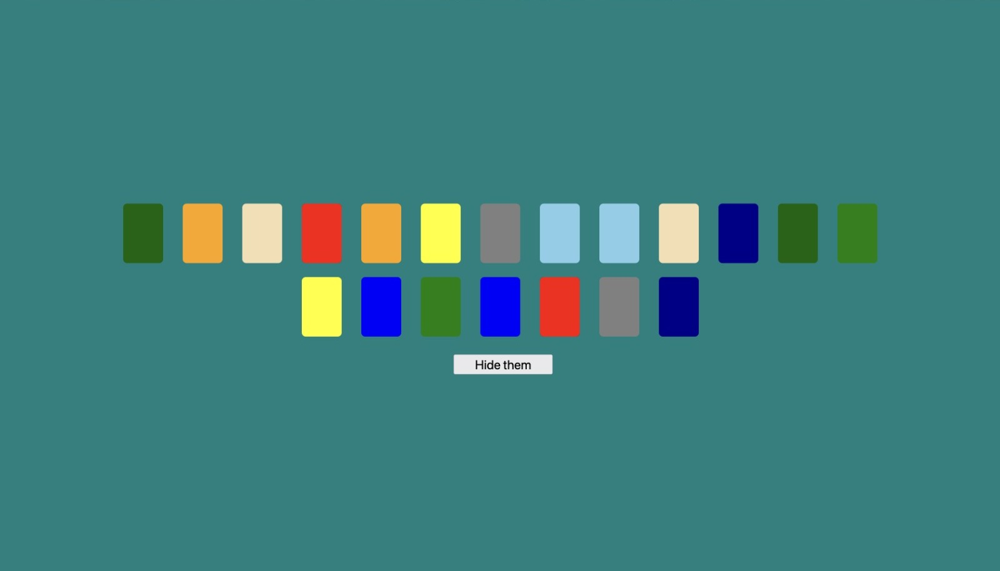

# Memory Game

Language: 
  
  

Coding Language/Framework: 
  
  
  

Tools: 
  
  
  

  
  
  

## Descrição

Mais um dos clássicos jogos velhos!

Este daqui, eu tomo grande prazer em ter recriado tudo por conta própria! Sem citações, sem vídeos necessários!

### Praticado:
    1. Animações de CSS
    2. Lógica por trás do jogo da memória
    3. Mantendo a simplicidade (Sério eu mal consigo me conter)

## Description

Another one of those classic old games from the old world!

This one, I take great pleasure in having recreated it all by myself! Not citations, no videos required!

### Practiced:
    1. CSS animations
    2. Logic behind the game Memory Cards
    3. Keeping it simple! (seriously I can barely hold myself)