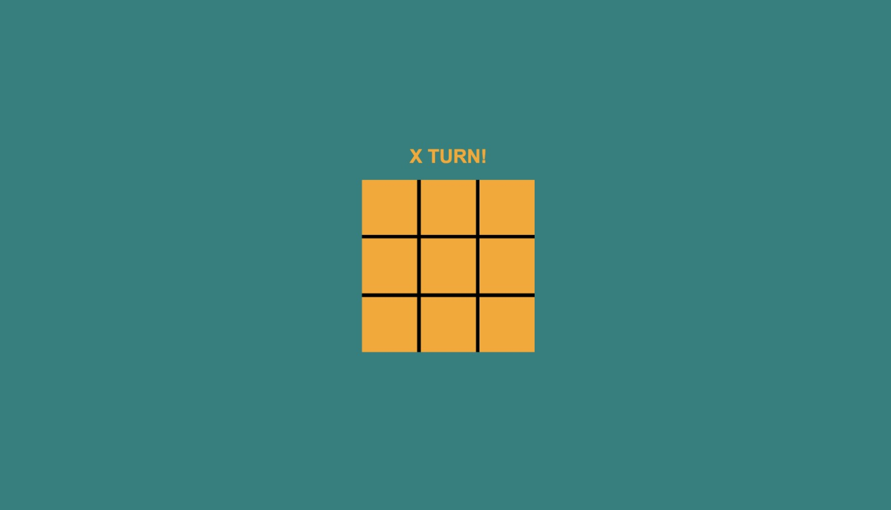
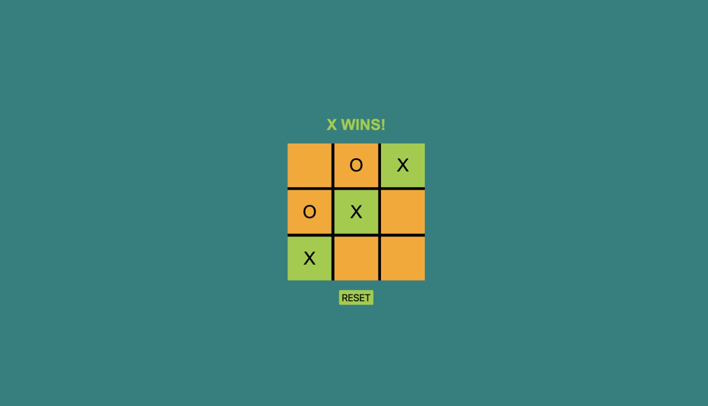
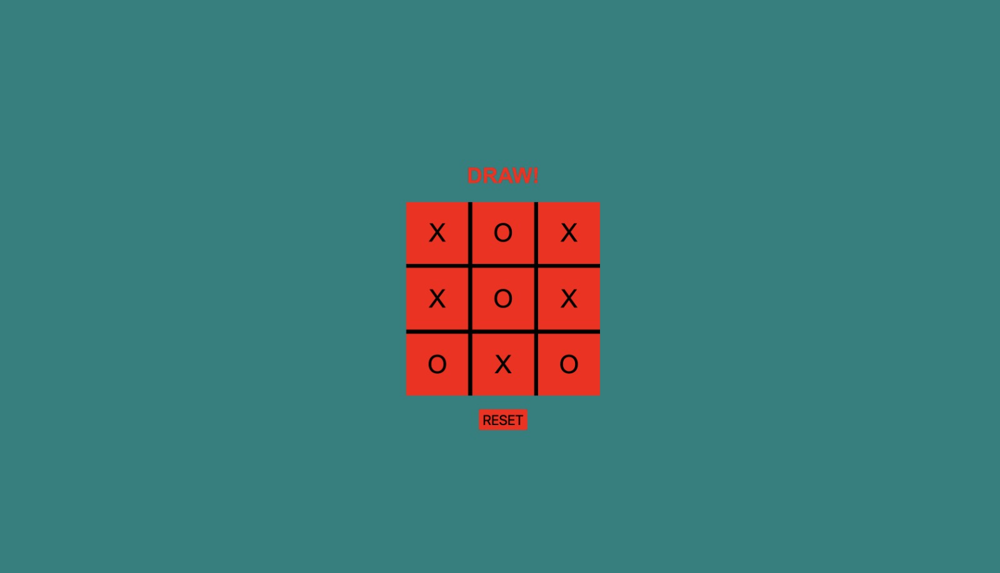

# Tic Tac Toe

Language: 
  
  

Coding Language/Framework: 
  
  
  

Tools: 
  
  
  

  
  
  

## Descrição

Para qualquer um novo no gênero, este foi o jogo escolar original!

This project has been done all by myself, nothing but inspiration was derived from searches, no code has been copied (You can tell by the quality lol).
O projeto foi feito todo por mim mesmo, nada além inspiração foi derivado de pesquisas, sem cópias de código (Pode apostar)

### Praticado:
    1. Event listeners (primeira vez usando event.target de forma "Legal" rsrs)
    2. Regras do jogo
    3. A lógica por trás do ciclo de vitória/empate
    4. Cores dinâmicas!

## Description

For anyone new to the genre, this was the original classroom game!

This project has been done all by myself, nothing but inspiration was derived from searches, no code has been copied (You can tell by the quality lol).

### Practiced:
    1. Event listeners (first time actually using event.target "legally" lol)
    2. Game rules
    3. The logic behind win/draw cycle!
    4. Dynamic colors!